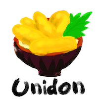

#Unidon


1 push to generate website.  
Unidon is static WebSite generater using Unity WebGL.

pro:[wu-ni-do-n]ウニ丼

##Automatic Website Generation
Unidon makes these ops automatically. this sequence contains WebGL Build.

* Scene -> Page convert
* make AssetBundle for each scenes.
* Load Index page when browse.

Only push **Menu > Unidon > Publish Site**

Your websites are located at YOUR_PROJECT/UnidonWeb folder. let's locate it to your site. e.g. Dropbox.

##Update page datas Fast!
**Menu > Unidon > Build Contents**

Unidon can update all page resources without WebGL Build.  
It's significantly **fast**.


##Installation
use UnidonInstaller.unitypackage


##Lightweight as possible
Unidon basically takes 4.4MB js resources. it contains uGUI and controller code resources.

not featherweight yet.　ああ、、鳥とかになりたい。


##About rule of Contents
Unity's standard uGUI features are supported.  
You can easily make your assets to web things.

but 2 rules exists.

1. Your Unity project should be in **Assets/UnidonContents** folder.
2. contents should keep naming rule. Assets/UnidonContents/MY_CONTENT/MY_CONTENT.unity
3. Index/Index.unity is also editable, but should not rename it.


##APIS(How to load page by script)
Unidon has some APIS for loading pages.

###back to index page
```C#
SiteManager.sManager.BackToIndex();
```

###go to other scene
```C#
var sceneName = "page1";// lower case of your scene name. without ".unity" extension.
SiteManager.sManager.OpenScene(sceneName);
```

##Motivation
no more javascript. --just kidding.  

I like compilable-web. Unity + WebGL is just for doing it.

* Keep loading fast. start page should be shown asap.
* Keep size small. it's desired but not enough yet.
* Can control like HTML sites. 


##Caution
It's not production level yet.

##License
MIT.